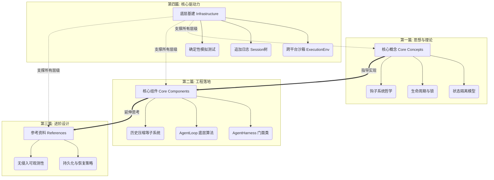

# 📚 Agent 架构知识库 (The Agent Architecture)

欢迎来到 `@earendil-works/pi-ai` 体系下 `packages/agent` 包的深度剖析知识库。

这份知识库并非简单的 API 参考手册，而是一本致力于探讨**如何构建健壮的、生产级的、支持高并发与长上下文的自主智能体 (Autonomous Agent)** 的高级架构教材。

## 🌟 为什么需要这套架构？

在探索本知识库之前，我们需要明确：开发一个能简单聊天的 AI 很容易，几行 API 调用即可完成。但在工程实践中，构建一个真实的 Agent 应用程序面临着巨大的挑战：

1. **执行流的不可预知性**：Agent 可能会连续调用十次工具，也可能在中间抛出各种网络异常。如何管理这种深度的异步操作流？
2. **状态与 UI 的并发冲突**：在 Agent 思考的这几分钟里，用户可能会在 UI 上疯狂点击，修改系统提示词、切换大模型、或者直接按下了“停止”。系统如何保证正在执行的逻辑不崩溃，同时又能正确吸收用户的意愿？
3. **极端的扩展性要求**：不同的业务需要不同的安全拦截、不同的日志记录、不同的上下文补全策略。如何设计一个解耦的系统，让上层业务开发人员无需修改核心引擎就能插入复杂的业务逻辑？

本知识库所讲解的 `AgentHarness` 与 `AgentLoop` 架构，正是为了彻底解决上述痛点而生。

## 🗺️ 知识体系导览 (The Knowledge Map)

本知识库分为四个层层递进的章节，建议读者按照顺序进行探索：

### 📖 第一部分：[[核心概念/Index|核心概念 (Core Concepts)]]
**建立正确的心理模型。**
在这一部分，我们将抛开繁杂的代码，探讨驱动 Agent 行为的底层逻辑。你将学习到为什么系统需要分为内外两层，状态是如何在并发中被保护的，以及事件驱动系统为什么使用了“幻影类型”。

### ⚙️ 第二部分：[[核心组件/Index|核心组件 (Core Components)]]
**深入源码的战壕。**
当理论落地为代码，我们将带你逐行剖析 `packages/agent` 的核心类。你将看到状态机是如何用 `try...finally` 和双层 `while` 循环构建起来的，以及那些为了极致性能而设计的工具并发算法。

### 📚 第三部分：[[参考资料/Index|参考资料 (References)]]
**解决那些最难的工程问题。**
这一部分源自系统的原始架构设计文档。它探讨了当系统真正走向生产环境时必须面对的残酷问题：如果进程意外崩溃，正在飞行的 Agent 如何从断点恢复？如何构建一套不依赖任何特定平台的 Trace 监控系统？

### 🏗️ 第四部分：[[底层基建/Index|底层基建 (Infrastructure)]]
**一切稳固大厦的地基。**
揭秘系统是如何通过依赖倒置原则（Dependency Inversion）实现跨平台运行的；持久化引擎为何弃用关系型数据库而选择 JSONL 追加日志；以及如何通过极其硬核的 Faux Provider 机制对这样一个混沌的异步巨兽进行自动化测试。

## 🚀 阅读建议

> [!important] 🟢 新手必读：从这里开始！
> 面对海量文档不知从何看起？请立刻查阅 **[[学习路径指南]]**。
> 我们为你准备了分为四个阶段的“闯关式”课表，带你从零基础一路晋升为 Agent 架构师。

> [!tip] 致应用开发者
> 如果你的目标是**基于这套系统开发应用（比如写一个 VSCode 插件）**，请重点关注 [[核心概念/AgentHarness]] 和 [[核心概念/钩子与事件]]。你需要理解如何向 Harness 注册你的工具和钩子，以及如何正确处理它的状态。

> [!tip] 致核心架构师/贡献者
> 如果你的目标是**参与到 Agent 底层引擎的维护中，或借鉴此架构重构公司的内部系统**，那么 [[核心组件/AgentLoop函数]]、[[参考资料/Index|参考资料]] 和全新的 [[底层基建/Index|底层基建]] 是你的必读物。你需要对依赖注入、异步边界和异常穿透有极其敏锐的直觉。

准备好了吗？点击进入 **[[核心概念/Index|第一部分：核心概念]]**，开始我们的架构之旅。
