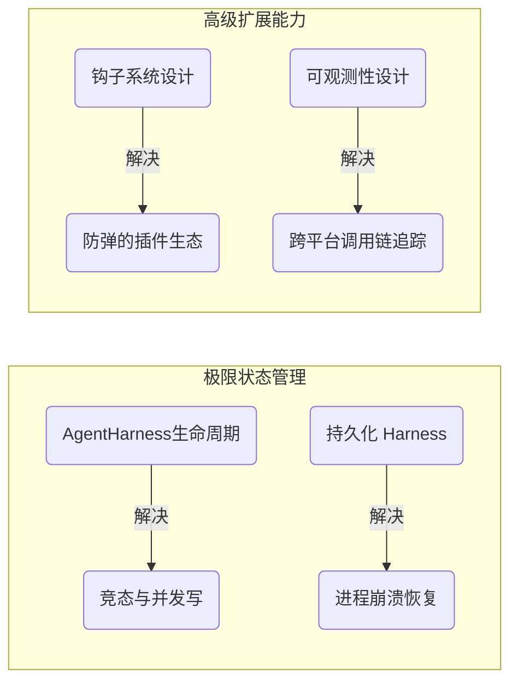

# 📚 第三篇：参考资料 (References)

欢迎来到知识库的最深处——参考资料章节。

前两篇我们探讨了“什么是系统”和“代码是如何编写的”。而这一篇，我们关注的是**极限工程（Extreme Engineering）**。这里的文章源自系统架构师们最初的设计手稿和决策记录，探讨的都是那些没有标准答案、充满妥协的架构难题。

如果你要维护一个千万级用户的生产系统，或者你需要为公司自研一套兼容各种奇怪平台的 AI 底层，这一章的经验将无价。

## 🎯 本章探讨的核心议题

本章不教你怎么用 API，而是教你怎么**设计系统**。
1. **一致性与锁**：在极度异步的环境下，如何保证事件触发的顺序绝不出错？
2. **崩溃与恢复**：当物理服务器断电时，那些正在执行“转账”工具的 Agent 重新启动后，应该继续还是报错？
3. **无侵入监控**：如何在一个不能引入任何第三方监控 SDK 的纯净库中，优雅地实现跨异步任务的调用链追踪？

## 📂 架构决策库 (ADRs - Architecture Decision Records)

本章包含四篇重量级的技术深潜文章：

### 1. 生命周期与容错
- **[[AgentHarness生命周期]]**: 这篇文档详细论述了为何在不同的层级必须使用不同的错误处理流派（底层的 `Result` 模式 vs 高层的 `Throw` 模式），以及那个极其严苛的“保存点在消息之后落盘”的因果律设计。
- **[[持久化Harness]]**: 探讨了 AI 系统的“半持久化（Semi-durable）”本质。由于工具代码是闭包无法落盘，这篇文档给出了明确的重启对齐算法和极为保守的未完成任务处理策略。

### 2. 观测与扩展
- **[[钩子设计]]**: 为什么废弃了经典的 `EventEmitter`？本文揭秘了基于幻影类型（Phantom Types）和 Reducer 模式构建的强类型防弹钩子系统。
- **[[可观测性]]**: 教你如何利用 Node.js 的 `AsyncLocalStorage` 解决异步上下文穿透的问题，并制定了一套与 OTel (OpenTelemetry) 完全解耦、且默认绝对保护用户隐私的追踪标准。

---

> [!quote] 架构师的箴言
> 软件工程中没有银弹，只有权衡（Trade-offs）。
> 读这些文档时，不要只看结论，要去体会当初为何放弃了 A 方案而选择了 B 方案。因为在未来的某一天，当系统的边界条件改变时，A 方案也许又会成为最好的选择。

请挑选你最感兴趣的难题，深入挖掘吧！
