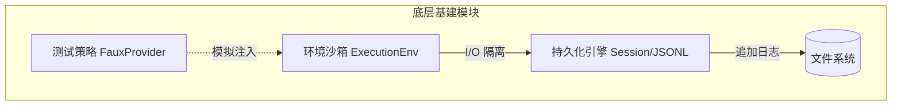

# 🏗️ 第四篇：底层基建 (Underlying Infrastructure)

如果说前三篇探讨的是 Agent 的“大脑”和“神经系统”，那么本篇探讨的则是它的“骨骼”和“血液”。

一个优秀的 Agent 框架之所以能够跨平台运行、保证数据不丢、且极易测试，完全归功于其扎实的底层基础设施建设。本章节将揭秘那些隐藏在华丽功能背后的脏活累活。

## 🎯 本章学习目标

通过阅读本章，你将掌握：
1. **树状持久化**：告别简单的数组存储，理解如何用 Append-only Log 构建支持时间穿梭的对话树。
2. **依赖倒置原则 (DIP)**：学习如何通过环境沙箱接口隔离 I/O，让 Agent 具备跨端运行能力。
3. **确定性测试**：掌握如何通过 Faux Provider 驯服不可控的大模型 API，进行极端的异步并发测试。

## 📂 章节导览

- **[[对话树与持久化引擎]]**: 深入 `Session` 的实现，解析 JSONL 格式如何完美契合 Agent 的流式特征。
- **[[跨平台环境沙箱]]**: 揭秘 `ExecutionEnv` 接口，探讨依赖倒置在跨平台和安全审计中的威力。
- **[[测试策略与模拟]]**: 探讨如何针对一个充斥着竞态、网络流和生命周期锁的系统编写确定性的单元测试。
