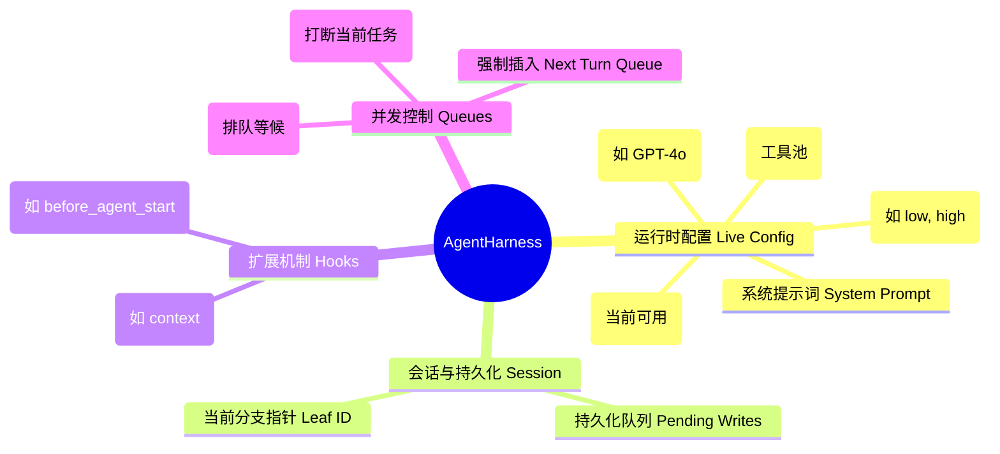

# 🕹️ AgentHarness (编排器)

如果说 `AgentLoop` 是驱动 AI 思考的引擎，那么 `AgentHarness` 就是整辆汽车的车身。它是系统中最核心的**编排层 (Orchestration Layer)**，也是外部应用（如 UI 或 CLI）与 Agent 交互的唯一安全入口。在现代的 AI Agent 架构中，直接与大模型交互的代码往往只占 20%，而剩下的 80% 代码都在处理状态管理、并发控制、错误恢复以及与宿主环境（如终端或浏览器）的集成，这 80% 的工作就是由 `AgentHarness` 完成的。

## 🎯 核心设计哲学

`AgentHarness` 的设计旨在解决现代 Agent 工程中的几个关键痛点：

> [!abstract] 1. 业务逻辑与执行逻辑的隔离
> 外部调用者（UI/CLI）不应去关心 Token 是如何流式的、API 请求失败如何重试、对话树分支如何切换，或者什么时候应该把 `ToolCall` 转换为特定的 JSON 格式。UI 只需要知道：“我传给 Agent 一句话，它最终给我一个结果，并在中间过程通知我进度”。Harness 提供了一个极其简单的接口，如 `harness.prompt("Hello")`，并在底层处理了所有复杂的生命周期和状态转换。

> [!abstract] 2. 协调并发变更与状态一致性
> LLM 思考一次可能耗时几十秒。如果在这几十秒内，用户在 UI 上点击了“切换到 Claude 3.5 模型”，或者“关闭联网搜索工具”，系统不能立刻应用这些修改，否则会导致当前正在进行的（基于 GPT-4 和全工具集的）思考过程崩溃，或者导致生成的历史记录产生逻辑断层。Harness 必须在不破坏当前思考过程的前提下，将用户的意图记录下来，并在下一次安全的时候（即所谓的回合保存点）应用。

## 🏗️ 架构管辖范围

`AgentHarness` 就像一个严密的沙盒，管理着 Agent 运行所需的所有外围设施。

### 1. 运行时配置 (Runtime Configuration) 的“双重身份”

在 Harness 中，配置具有“活配置 (Live Config)”和“快照 (Snapshot)”的双重身份。

*   **活配置 (Live Config)**：Harness 始终在内存中维护着应用程序期望的最新状态。当你调用 `harness.setModel(newModel)` 时，活配置会立刻更新。这意味着无论何时你调用 `harness.getModel()`，你得到的总是 UI 上显示的那个最新模型。
*   **回合快照 (Turn Snapshot)**：然而，为了保证执行引擎 `AgentLoop` 的绝对稳定，每次调用 `prompt` 启动新的回合时，Harness 会对当前的“活配置”进行一次浅拷贝，生成 `TurnSnapshot`。在整个这个回合（可能包含好几次大模型请求和工具调用）中，引擎只认这个快照。这种设计被称为**快照隔离 (Snapshot Isolation)**，它优雅地解决了并发修改的问题。

### 2. 会话与持久化边界 (Session Boundary)

Harness 自身并不负责读写磁盘，但它桥接着底层的 `Session` 对象。它充当了**持久化的守门员**。

Harness 保证了：任何改变状态的操作（哪怕只是改了一下大模型，或者修改了思考级别），最终都会被序列化为一个不可变的日志项（Entry）写入 Session。
例如，用户修改模型不仅仅是改变内存变量，Harness 最终会向 Session 写入一条 `model_change` 类型的 Entry。这种设计的意义在于：
*   **可溯源性**：当你回顾历史记录时，你可以清楚地看到：“在前三轮对话中，用户使用的是 Claude，然后在这里，用户切换到了 GPT-4”。
*   **完美恢复**：如果系统崩溃重启，Harness 可以通过重放 Session 中的历史记录（包括这些配置变更记录），完美还原崩溃前一秒的上下文和配置状态。

### 3. 操作锁定与三级流控队列

为了在 Agent 忙碌时处理用户的并发输入，Harness 实现了一套非常精巧的三级排队机制。这三种队列处理了完全不同的交互场景：

#### A. Steer Queue (转向队列：即时打断与修正)
*   **场景**：Agent 正在疯狂地使用工具编写一个复杂的 Python 脚本。用户发现它走错了方向，立刻在输入框打字：“等等，别用 Python，客户要求必须用 Go 语言实现”。
*   **机制**：这句话会被放入 `Steer Queue`。Agent 在完成当前正在执行的那个 Python 工具调用后，在发起下一次大模型 API 请求之前，Harness 会清空 Steer Queue，将这句话以 User Message 的形式“强行塞入”对话上下文中。大模型看到这句话后，就会在接下来的步骤中立刻纠正行为（Steer/转向）。

#### B. Follow-up Queue (后续队列：排队等候)
*   **场景**：Agent 正在执行一个长达 5 分钟的“重构项目”任务。用户不想打断它，但想给它安排下一个任务：“你重构完之后，记得帮我写一下单元测试”。
*   **机制**：这句话会被放入 `Follow-up Queue`。它不会打断当前的回合。只有当 Agent 认为“重构项目”这个任务彻底完成，原本准备结束运行（退出 Loop）时，Harness 会检查后续队列。发现有任务，Harness 就不会退出，而是立刻以这句话作为起点，开启一个全新的对话回合。

#### C. Next Turn Queue (强制预备队列：系统级插入)
*   **场景**：这是一个偏向内部系统的队列。有时系统需要在下一个回合开始时，强制附加一些隐藏的指令或状态报告。
*   **机制**：放入此队列的消息，必定会在下一次调用 `prompt()` 时，被静默插入到用户的输入之前，作为上下文的一部分被发送。

---

> [!question] 深度思考题
> 为什么在 `AgentHarness` 中，不仅有针对消息的队列（如 Steer 队列），还有一个专门的 `PendingSessionWrites` 队列？两者有什么区别？
> 
> *解析：消息队列（Steer/Follow-up）是为了改变 **LLM 接下来要看到的上下文**；而 `PendingSessionWrites`（挂起写入队列）是为了解决 **系统自身的数据库写入锁** 问题。当 Harness 处于 Busy 状态时，为了不破坏当前历史树的时间线索引，所有非消息的元数据修改（如模型变更标记）都会被放入 Pending 队列，直到回合结束的“保存点”再一口气写入数据库。前者是对内的业务逻辑，后者是对外的 IO 控制。*

在下一节中，我们将掀开引擎盖，深入研究 Harness 驱动的核心引擎是如何处理流式数据和并发工具调用的：[[AgentLoop]]。
