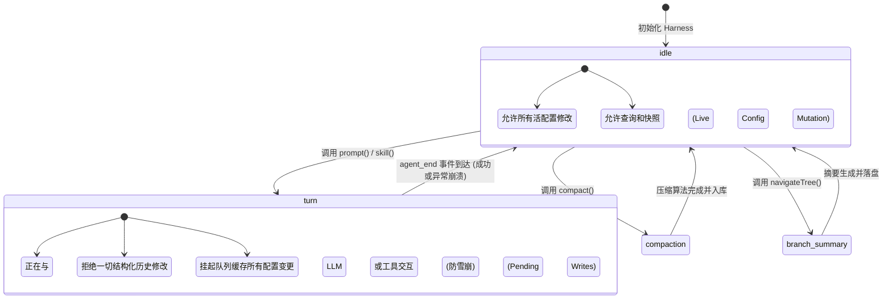

# ⏳ 生命周期 (Lifecycle)

对于一个长时间运行、支持流式输出、并且随时接受外部中断的 AI 系统而言，如果没有严密的生命周期管理，系统状态将在并发操作的冲击下瞬间崩溃。`AgentHarness` 引入了一套**基于状态机**的严格生命周期约束，这是保证数据一致性、并发安全以及重试/恢复可靠性的基石。

## 🚥 操作阶段 (Phases) 状态机：防止灾难的护城河

在任何给定的微秒内，Harness 都必定处于以下五个有限状态阶段之一。这个阶段指针（`phase`）是整个系统最顶级的并发锁。

```typescript
type AgentHarnessPhase = "idle" | "turn" | "compaction" | "branch_summary" | "retry";
```



> [!danger] Busy 保护机制 (Busy Protection)
> **为什么要设定这些锁？** 想象一个场景：底层引擎正在基于长度为 100 的历史数组，准备调用工具，而上层的 UI 界面上，用户点击了“清理历史记录”或“切换到另一个对话分支”。如果 Harness 允许这种操作立刻发生，底层引擎的数组索引瞬间失效，系统立刻就会发生“越界（Out of Bounds）”或空指针灾难。
> 
> 因此，当阶段不为 `idle` 时，任何尝试执行结构性操作（如调用 `compact` 压缩历史，或 `navigateTree` 切换分支）的调用，都会立刻被 Harness 拦截，并抛出 `Busy` 异常。

## 🔄 单次对话 (Turn) 的微观旅程：一步步拆解

为了彻底理解这套系统，让我们放慢速度。当用户在聊天框输入一句话 "你能帮我检查一下 app.js 的错误吗" 并按下回车，在底层的毫秒间，系统经历了怎样史诗般的旅程？

1. **🔒 状态加锁 (Locking)**: 
   - 外部调用 `harness.prompt(text)`。
   - 验证阶段为 `idle`。如果不是，拒绝服务。
   - 立即将 `phase` 切换为 `turn`。系统进入封闭执行状态。
2. **📸 截取快照 (Snapshotting)**: 
   - 调用 `createTurnState()`。系统就像拍了一张宝丽来照片，把当前选择的大模型、温度参数、激活的工具、当前的系统提示词，全部克隆并锁定在一个对象中（Turn Snapshot）。
   - 在这个回合结束前，不管外界怎么风云变幻，引擎只看这张“照片”。
3. **💉 队列注入 (Queue Injection)**: 
   - 系统检查 `nextTurnQueue` 中是否潜伏着上一轮遗留的强制指令。如果有，将它们提取出来，无缝拼接到用户输入的 "你能帮我检查一下..." 之前。
4. **🪝 发射全局前置钩子 (Pre-start Hook)**: 
   - 触发 `before_agent_start` 事件。
   - 这是所有的扩展插件（Extensions）最后一次修改剧本的机会。某个插件可能会立刻去读取 `app.js` 的前 10 行，并将其偷偷塞进即将发出的请求中。
5. **🚀 引擎启动 (Loop Ignition)**: 
   - 彻底将控制权交给底层的 `AgentLoop` 算法引擎。
   - 发出 `agent_start` 和 `turn_start` 事件。
   - **进入无尽的循环**：`发送网络请求 -> 接收流式字符 (触发 message_update) -> 遇到工具请求 -> 执行工具 (触发 tool_execution_start/end) -> 将结果转为消息追加到快照上下文中 -> 再次发起网络请求`。
   - 当模型终于说：“我检查完了，app.js 没有错误”，并停止调用工具时，当前回合的推理结束，发出 `turn_end` 事件。
6. **💾 保存点 (Save Point: The Critical Moment)**:
   - 这是一个至关重要的数据一致性时刻。
   - `AgentLoop` 会调用回调函数询问 Harness：“本轮交锋结束，你需要打扫战场吗？”
   - Harness 启动 `flushPendingSessionWrites()`。它会去检查那个名为“挂起写入队列”的抽屉。如果用户在等待模型思考时手痒点了一下“将模型切换为 Claude”，Harness 会在此刻把这个动作正式写入数据库的历史线中。
   - 这是一个绝对安全的时刻，因为底层的上下文在这个刹那是静态的。
7. **🔓 释放锁定与退出清理 (Teardown & Unlock)**:
   - 引擎判断彻底没有任务了，发出最终的 `agent_end`。
   - 进入外部 Promise 的 `finally` 代码块。
   - 无论系统是圆满完成，还是因为断网抛出了异常栈，`phase` 都必须被强制重置回 `idle`。
   - 触发最后一个 Harness 特有事件：`settled`。告诉整个应用程序：“我彻底停下来了，所有的文件和数据库都已同步，你们可以放心地刷新 UI 了。”

## 🛑 Abort (安全中止语义)：优雅地刹车

在一个健壮的系统中，“如何停下来”往往比“如何跑起来”更复杂。用户随时可以点击界面上的“⏹ 停止生成”按钮。

调用 `harness.abort()` 是一门艺术，它必须保证破坏力降到最低：
1. **阻断网络流**：Harness 首先触发挂载在当前运行回合上的 `AbortController.abort()`。底层的流解析器收到信号，会立刻切断与大模型厂商的 HTTP/WebSocket TCP 连接。
2. **安全的异常捕获**：底层的 `AgentLoop` 捕获到 Abort 异常，它不会任由其冒泡导致进程崩溃，而是将其包装为一条合法的结束消息，带有特殊标记 `stopReason: "aborted"`。这条消息会被安全地追加到对话树中（“生成到一半的乱码”也得到了妥善保存，用户不会丢失数据）。
3. **清洗控制队列**：Harness 会立刻清空 `Steer Queue` 和 `Follow-up Queue`。因为用户既然叫停了当前任务，之前排队的后续指导显然也作废了。
4. **不遗漏的写入**：**非常关键的保证**：中止绝对不会导致元数据丢失。那些被挂起在内存里还没落盘的配置修改（Pending Writes），依然会在退出的 `finally` 清理阶段被一丝不苟地刷新到硬盘（触发上述的第 6 步保存点机制）。

---

> [!question] 架构验证
> 请思考：如果在 `AgentLoop` 正在执行一个耗时 10 秒的文件读取工具时，用户按下了 Abort 按钮，会发生什么？
>
> *提示：系统向工具的 `execute` 函数传递了同一个 `AbortSignal`。如果工具实现得当（即工具内部监听了信号），它会立即中断本地的文件读取流，抛出 `AbortError`。AgentLoop 捕获该错误，将其作为“执行失败的工具结果”发送出去，从而快速而优雅地终结当前回合。这体现了 `AbortSignal` 贯穿整个技术栈的穿透力。*
