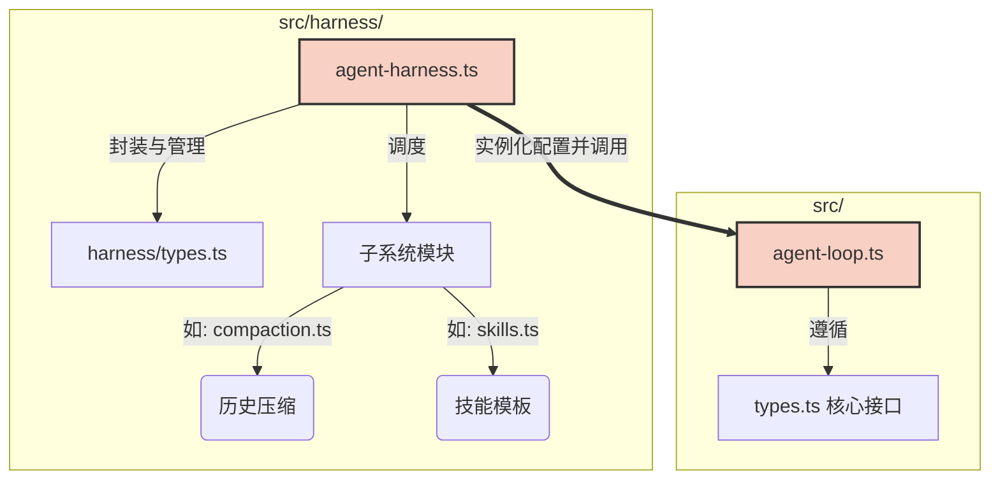

# ⚙️ 第二篇：核心组件 (Core Components)

欢迎来到核心组件章节。在这里，我们将脱下理论的外衣，穿上工程师的工作服，直接跳进 `packages/agent` 的代码战壕。

本章节不再停留在“它为什么这么设计”，而是深入探讨“**它在代码里到底是怎么写出来的**”。我们将逐个拆解核心类的属性、循环的控制流，以及那些为了性能和健壮性而做出的精妙妥协。

## 🎯 本章学习目标

通过阅读本章的源码剖析，你将能够：
1. **掌握控制流向**：精准追踪一段 Prompt 从外部输入、经过层层拦截、到达大模型、再带着结果返回持久化层的每一行代码路径。
2. **洞悉并发艺术**：理解 `AgentLoop` 是如何利用 `Promise.all` 榨干工具执行的性能，同时又利用排序机制保证日志绝对一致性的。
3. **熟练运用类型**：学会利用 `CustomAgentMessages` 进行声明合并，编写出类型安全的自定义系统扩展。

## 📂 核心代码地图 (The Code Map)

本章的内容紧密对应着源码仓库中的关键文件，你可以配合着 IDE 一起阅读。

### 1. 结构与契约
一切从接口开始。
- **[[核心类型]]**: 探究贯穿全系统的 `AgentMessage` 和 `AgentLoopConfig`。看看一个支持多层级扩展的强类型系统是如何通过 TypeScript 的各种高级特性（如声明合并、泛型）编织出来的。

### 2. 两大核心实现
深入拆解主宰一切的两个文件：
- **[[AgentHarness类]]**: `src/harness/agent-harness.ts`。带你详读那长达千行的 `executeTurn` 函数，看看它是如何在 `try...finally` 中死死守住持久化底线的。
- **[[AgentLoop函数]]**: `src/agent-loop.ts`。直击灵魂的双层 `while` 循环，以及那个把碎片化流数据重新拼装成完整对象的复杂状态机。

### 3. 高级武器库
核心引擎之外，系统还配备了各种重火力武器：
- **[[Harness子系统]]**: 当你的历史记录超过了 128k Token 怎么办？当你在不同的决策树分支间跳跃时，Agent 会失忆吗？去看看这些精巧的子系统是如何用算法和 LLM 自身的归纳能力解决这些难题的。

---

> [!warning] 源码阅读提示
> 本章节中会出现大量的伪代码和逻辑流程图。这并不是为了让你死记硬背代码，而是为了让你建立起对代码结构的**空间感**。当你在真实的 Debug 中迷失在长长的堆栈（Call Stack）里时，这种空间感能帮你瞬间定位问题所在。

现在，让我们推开第一扇门，看看这座大厦的图纸：**[[核心类型]]**。
